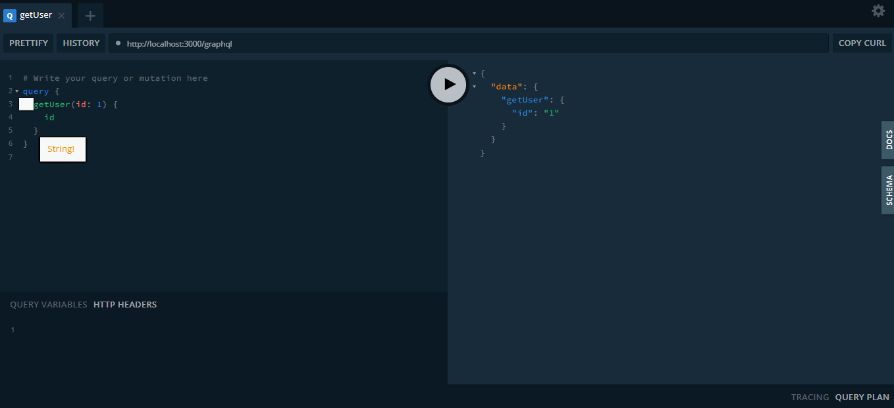

# 🏆 Desafio Backend - NestJS + GraphQL + TypeORM

## Pré-requisitos para executar a aplicação:
 - [Node.js](https://nodejs.org/pt)
 - De acordo com seu sistema operacional:
   - [Docker Desktop - Windows](https://docs.docker.com/desktop/setup/install/windows-install/)
   - [Docker Desktop - Mac](https://docs.docker.com/desktop/setup/install/mac-install/)
   - [Docker Desktop - Linux](https://docs.docker.com/desktop/setup/install/linux/)

## Instalação das dependências

Considerando que você já tenha o Node e o Docker instalado, no diretório raiz do projeto, execute:
```bash
$ npm install
```

Para executar a aplicação em modo de desenvolvimento:

```bash
$ docker-compose up
```
## Para executar os testes


Únitarios
```bash
$ npm run test:unit
```
Integração
```bash
$ npm run test:e2e
```

## Rodei a aplicação, e agora?
Você pode acessar o playground do GraphQL através da rota: `localhost:3000/graphql`

Nele você encontrará os Schemas da API e uma documentação dos resolvers que podem ser usados


